# Deployment Architecture Guide

Overview of Cloud Artifact Extractor deployment architecture for each platform.

**Last Updated:** November 1, 2025

---

## AWS App Runner Architecture

### Component Diagram

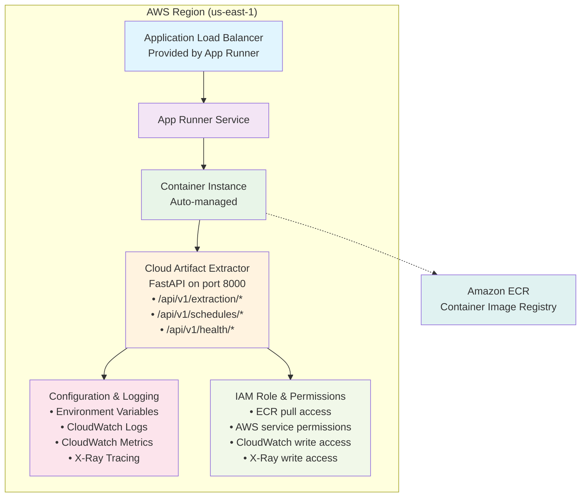

### Data Flow

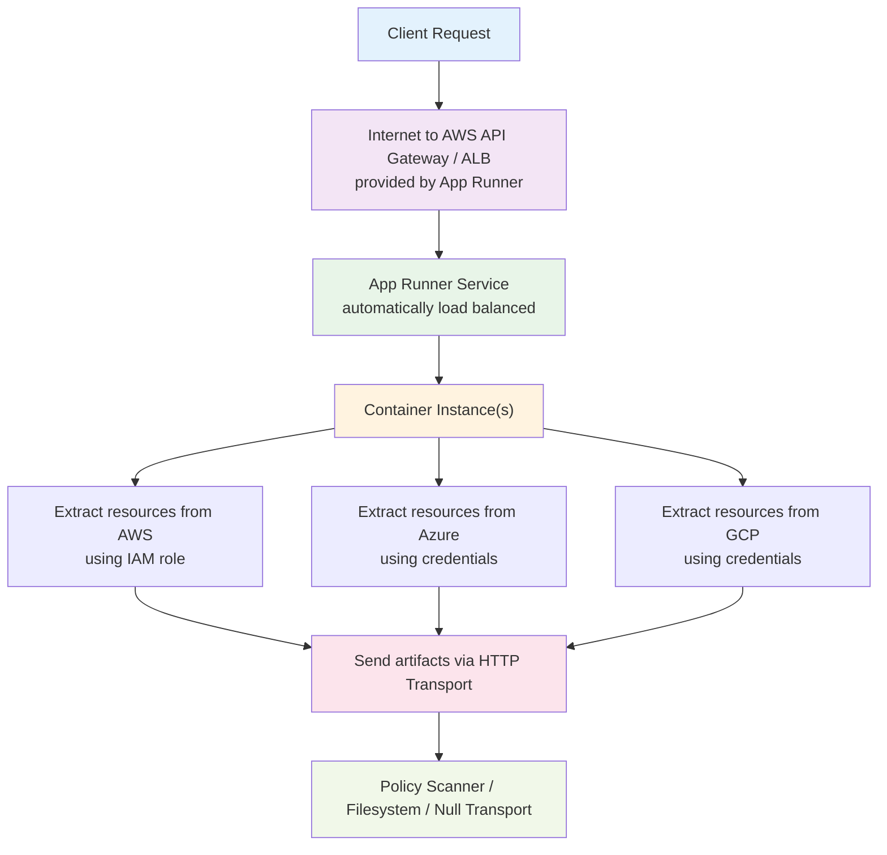

### Key Features

- **Managed Load Balancing:** Automatic distribution across replicas
- **Auto-Scaling:** Based on CPU and memory utilization
- **Auto-Recovery:** Failed instances automatically replaced
- **VPC Integration:** Optional private deployment
- **CloudWatch Monitoring:** Built-in metrics and logs
- **CI/CD Ready:** Direct source repository integration

---

## Azure Container Apps Architecture

### Component Diagram

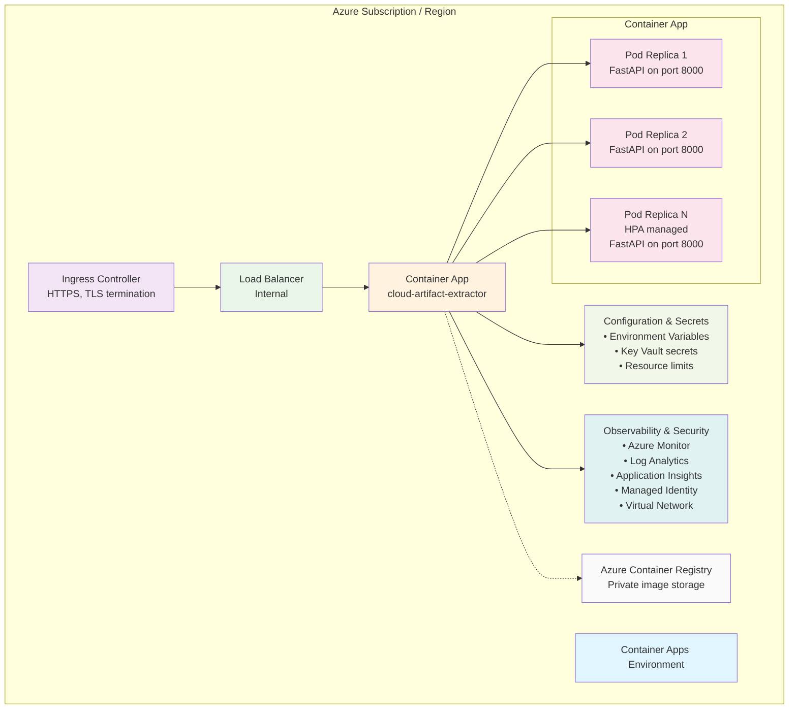

### Data Flow

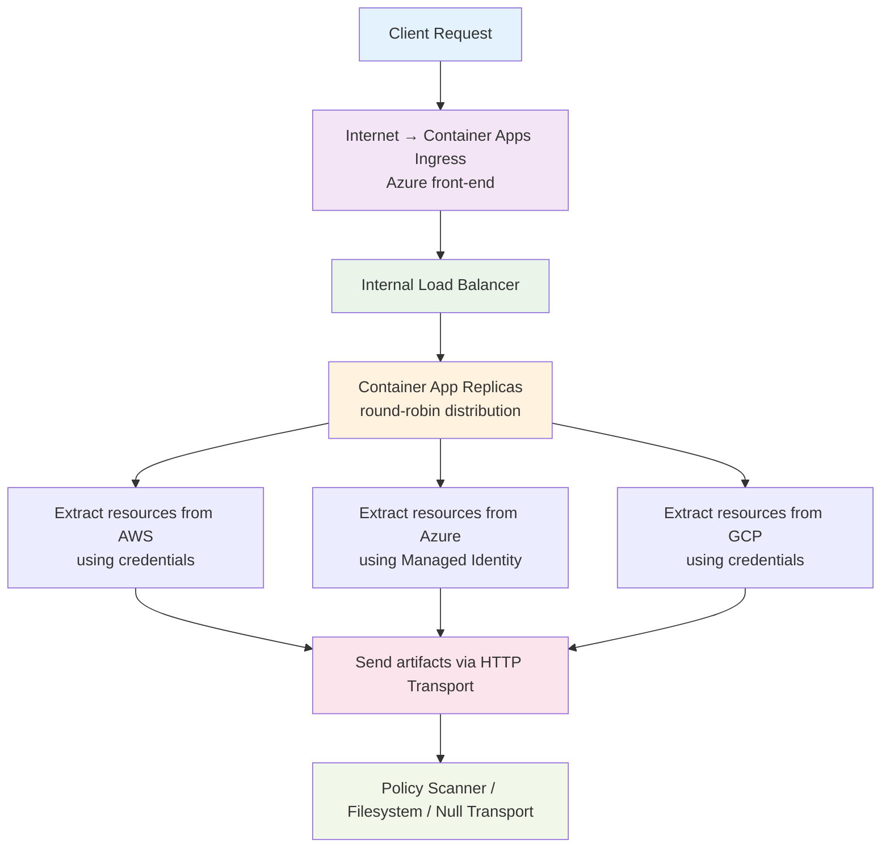

### Key Features

- **Managed Kubernetes:** Built on top of Kubernetes without complexity
- **DAPR Support:** Distributed application runtime integration
- **Automatic Scaling:** Based on multiple metrics
- **Private Networking:** Virtual Network integration
- **Log Analytics:** Centralized logging with KQL queries
- **Application Insights:** Built-in APM and diagnostics
- **Managed Identity:** Secure credential handling

---

## Google Cloud Run Architecture

### Component Diagram

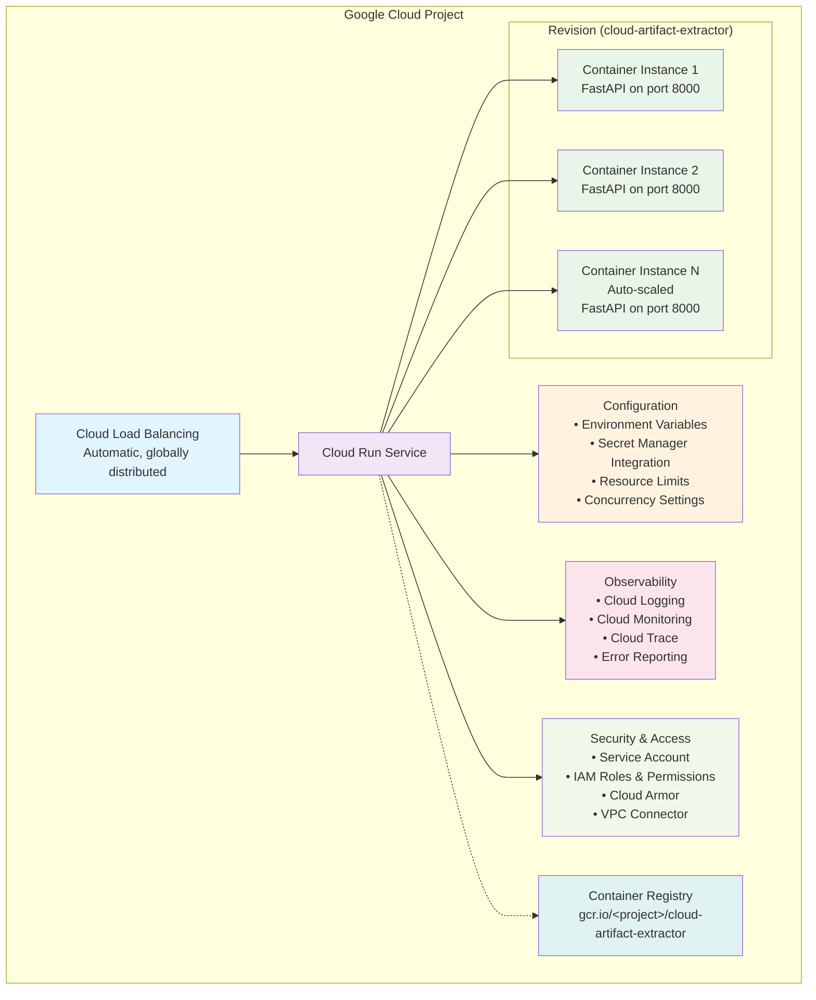

### Data Flow

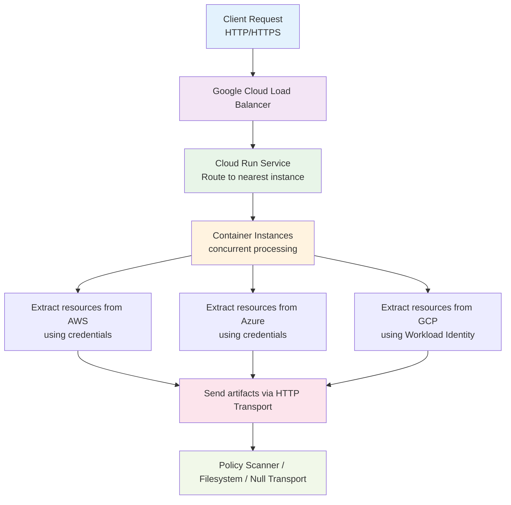

---

## Kubernetes Architecture (EKS/AKS/GKE)

### Component Diagram

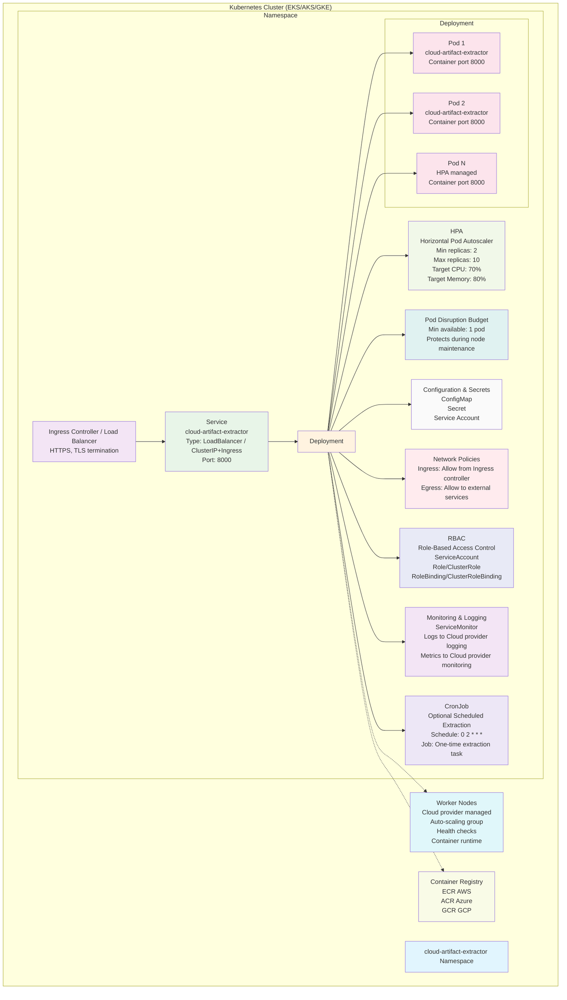

### Data Flow

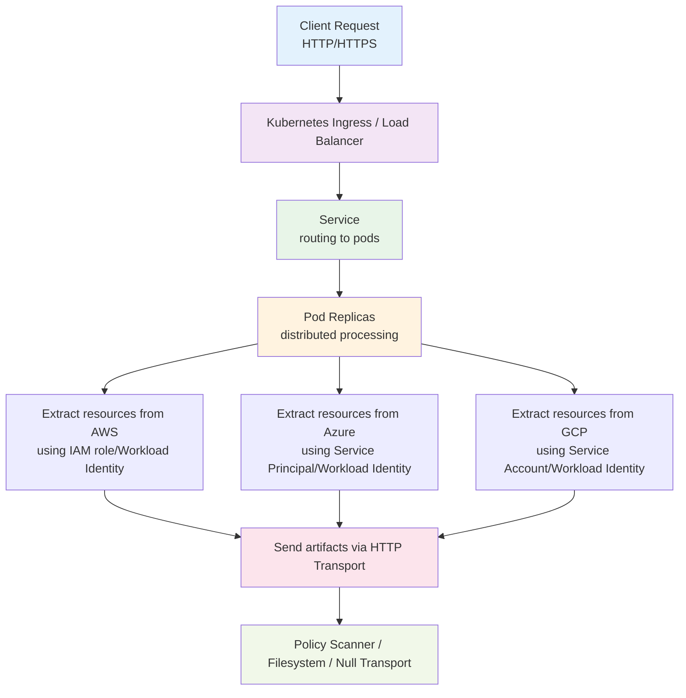

---

## Common Architecture Patterns

### 1. Request Routing Flow

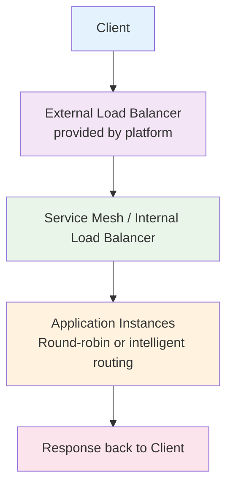

### 2. Configuration Management

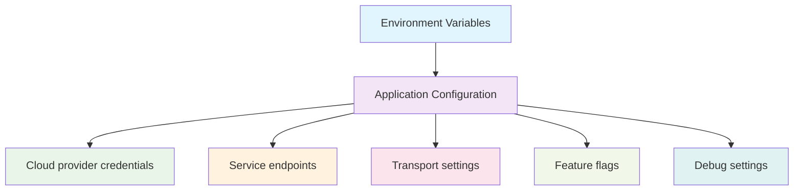

### 3. External Integration Points

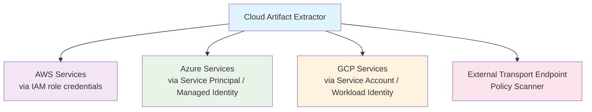

### 4. Observability Stack

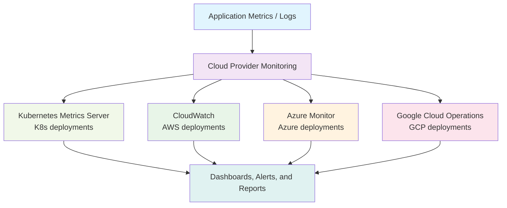

---

## Deployment Comparison by Architecture

| Aspect | AWS App Runner | Azure Container Apps | Cloud Run | Kubernetes |
|--------|---|---|---|---|
| **Management** | Fully Managed | Fully Managed | Fully Managed | Self-Managed |
| **Load Balancing** | Built-in | Built-in | Global (built-in) | Service-based |
| **Scaling** | Automatic | Automatic + metrics | Automatic 0-N | HPA + Manual |
| **Networking** | VPC available | vNET available | VPC Connector | Full CNI |
| **Observability** | CloudWatch | Azure Monitor | Cloud Logging | Prometheus/ELK |
| **Secrets Management** | IAM / Parameters | Key Vault | Secret Manager | etcd/Sealed Secrets |
| **Multi-region** | Via services | Traffic Manager | Native | Manual federation |

---

## Next Steps

1. **Review the architecture** relevant to your deployment platform
2. **Understand the data flow** for your use case
3. **Check the platform-specific deployment guide** for setup details
4. **Configure observability** according to your monitoring needs
5. **Plan for scaling** based on expected traffic

For detailed deployment instructions, see the platform-specific guides:
- [AWS App Runner Guide](../deploy/aws/README.md)
- [Azure Container Apps Guide](../deploy/azure/README.md)
- [GCP Cloud Run Guide](../deploy/gcp/README.md)
- [Kubernetes Guide](../deploy/kubernetes/README.md)
