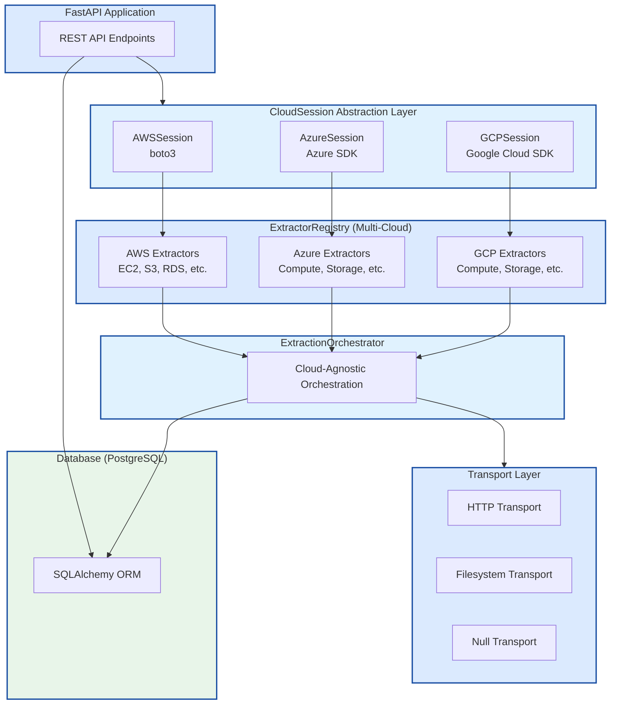
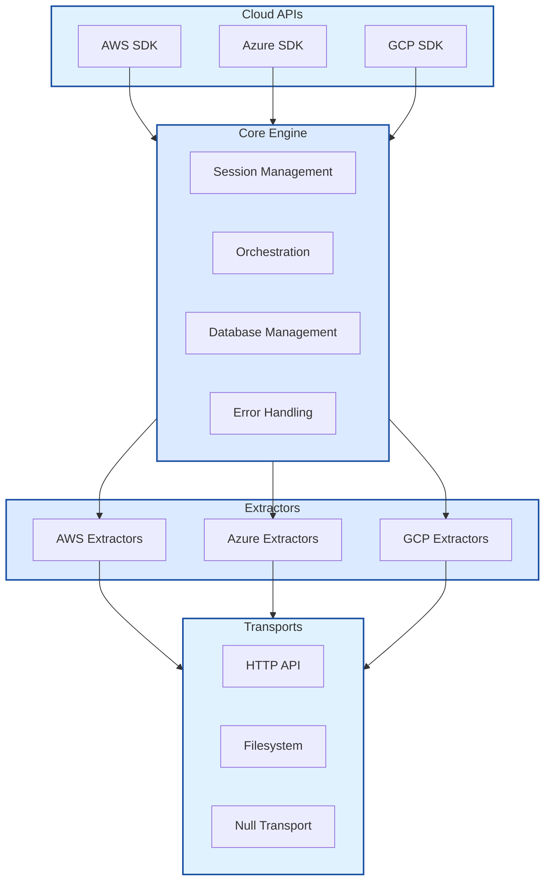

# Implementation Details

This document provides technical details about the Cloud Artifact Extractor's architecture, design patterns, and implementation specifics.

## System Architecture

The Cloud Artifact Extractor follows a modular, cloud-agnostic architecture designed for scalability, maintainability, and extensibility.

### High-Level Architecture



### Component Interaction



## Core Components

### 1. Cloud Sessions

Cloud sessions provide authenticated, provider-specific connections:

```python
# app/core/sessions.py
class CloudSession(ABC):
    """Abstract base class for cloud provider sessions"""
    
    @abstractmethod
    def get_client(self, service_name: str) -> Any:
        """Get authenticated client for specific service"""
        pass
    
    @abstractmethod
    def get_credentials(self) -> Dict[str, str]:
        """Get session credentials for serialization"""
        pass
```

### 2. Extractor Pattern

All resource extractors follow a consistent interface:

```python
# app/extractors/base.py
class BaseExtractor(ABC):
    """Base class for all cloud resource extractors"""
    
    def __init__(self, session: CloudSession, config: ExtractorConfig):
        self.session = session
        self.config = config
        self.metadata = ExtractorMetadata(
            service_name=self.get_service_name(),
            resource_types=self.get_resource_types()
        )
    
    @abstractmethod
    def extract(self) -> Iterator[Dict[str, Any]]:
        """Extract resources from cloud provider"""
        pass
```

### 3. Transport Layer

Transports handle output delivery:

```python
# app/transport/base.py
class BaseTransport(ABC):
    """Base class for output transports"""
    
    @abstractmethod
    def send(self, data: Dict[str, Any]) -> None:
        """Send extracted data to destination"""
        pass
```

### 4. Database

The database component, implemented using SQLAlchemy, provides a persistence layer for jobs, schedules, and configuration.

```python
# app/models/database.py

class ExtractionJob(Base):
    __tablename__ = "csp_scanner_extraction_jobs"
    # ... columns ...

class Schedule(Base):
    __tablename__ = "csp_scanner_schedules"
    # ... columns ...

class ConfigEntry(Base):
    __tablename__ = "csp_scanner_config"
    # ... columns ...

class ConfigVersion(Base):
    __tablename__ = "csp_scanner_config_versions"
    # ... columns ...

class DatabaseManager:
    def __init__(self, database_url: str):
        self.engine = create_async_engine(database_url)
        # ...

    async def create_job(self, ...) -> ExtractionJob:
        # ...
```

## Design Patterns

### Factory Pattern for Sessions

```python
class SessionFactory:
    @staticmethod
    def create_session(provider: str, config: Dict[str, Any]) -> CloudSession:
        if provider == "aws":
            return AWSSession(**config)
        elif provider == "azure":
            return AzureSession(**config)
        elif provider == "gcp":
            return GCPSession(**config)
        else:
            raise ValueError(f"Unsupported provider: {provider}")
```

### Strategy Pattern for Extractors

```python
class ExtractorStrategy:
    def __init__(self, session: CloudSession):
        self.session = session
        self.extractors = {
            "aws:ec2": EC2Extractor,
            "aws:s3": S3Extractor,
            "azure:compute": AzureComputeExtractor,
            "gcp:compute": GCPComputeExtractor,
        }
    
    def get_extractor(self, resource_type: str) -> BaseExtractor:
        # ...
```

## Testing Strategy

The project employs a two-tiered testing strategy:

### 1. API and Service Level Tests

These tests use a mocked backend for external services, including the database. This allows for fast, isolated tests that can be run frequently during development.

```python
# tests/test_main_app.py
def test_trigger_extraction(client: TestClient, mock_orchestrator):
    response = client.post("/extraction/trigger", json={"provider": "aws"})
    assert response.status_code == 200
    assert "job_id" in response.json()
```

### 2. Database Layer Tests

These tests use a temporary, file-based SQLite database that is created and destroyed for each test function. This ensures that the database logic is tested thoroughly and in isolation.

```python
# tests/test_database_manager.py
@pytest.mark.asyncio
async def test_job_crud_operations(tmp_path):
    db_url = f"sqlite+aiosqlite:///{tmp_path}/test.db"
    db_manager = DatabaseManager(db_url)
    await db_manager.create_all()

    new_job = await db_manager.create_job(status="running", provider="aws")
    retrieved_job = await db_manager.get_job(new_job.id)
    assert retrieved_job.status == "running"
```