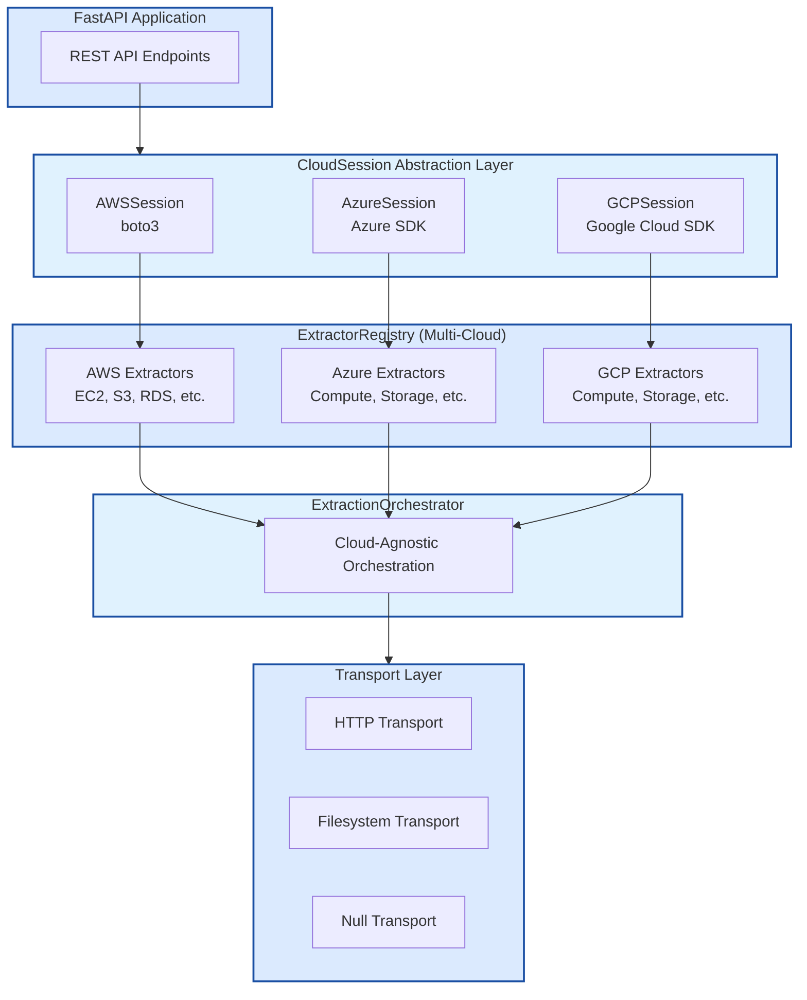

  
Cloud Artifact Extractor

  
A modern FastAPI service for extracting and managing cloud service artifacts from AWS, Azure, and GCP. Beautiful, secure, and multi-cloud ready.

  <a href="/csp-scanner/getting-started.html" class="btn">Get Started</a>

# Cloud Artifact Extractor

(https://pytest-cov.readthedocs.io/)(https://pytest-cov.readthedocs.io/)(https://pytest-cov.readthedocs.io/)(https://pytest-cov.readthedocs.io/)(https://pytest-cov.readthedocs.io/)(https://pytest-cov.readthedocs.io/)

A FastAPI-based service for extracting and managing cloud service artifacts from AWS, Azure, and GCP.

## 🚀 Quick Start

Get up and running in minutes:

- **[Installation & Setup](/csp-scanner/getting-started.html)** - Install dependencies and configure your environment
- **[Configuration Guide](/csp-scanner/configuration.html)** - Learn about configuration options and transport methods
- **[API Reference](/csp-scanner/api-reference.html)** - Explore available API endpoints

## ☁️ Cloud Providers

The CSP Scanner supports extracting resources from multiple cloud providers:

### Amazon Web Services (AWS)
- **Setup**: [AWS Configuration](/csp-scanner/cloud-providers.html#aws-setup)
- **Resources**: 13+ services including EC2, S3, RDS, Lambda, IAM, VPC
- **Authentication**: Access keys, IAM roles, environment variables

### Microsoft Azure
- **Setup**: [Azure Configuration](/csp-scanner/cloud-providers.html#azure-setup)
- **Resources**: 8+ services including Compute, Storage, Network, Web Apps, SQL
- **Authentication**: Service Principal, Managed Identity, Azure CLI

### Google Cloud Platform (GCP)
- **Setup**: [GCP Configuration](/csp-scanner/cloud-providers.html#gcp-setup)
- **Resources**: 2+ services including Compute Engine, Cloud Storage
- **Authentication**: Service Account keys, Application Default Credentials

## 📋 Supported Resources

View the complete list of [supported cloud resources](/csp-scanner/supported-resources.html) across all providers.

## 🛠️ Development

- **[Contributing Guide](/csp-scanner/development.html)** - How to contribute to the project
- **[Architecture Overview](/csp-scanner/development.html#architecture)** - Understanding the codebase
- **[Testing](/csp-scanner/development.html#testing)** - Running tests and coverage

## 📖 Documentation Sections

### User Guides
- [Getting Started](/csp-scanner/getting-started.html) - Installation and basic setup
- [Configuration](/csp-scanner/configuration.html) - Detailed configuration options
- [Cloud Providers](/csp-scanner/cloud-providers.html) - Provider-specific setup guides
- [Supported Resources](/csp-scanner/supported-resources.html) - Complete resource coverage
- [API Reference](/csp-scanner/api-reference.html) - REST API documentation

### Developer Resources
- [Development](/csp-scanner/development.html) - Contributing and development setup
- [Metadata Structure](/csp-scanner/metadata-structure.html) - Cloud-agnostic data format
- [Implementation Details](/csp-scanner/implementation-details.html) - Architecture and design

## 🔧 Key Features

- **Multi-Cloud Support**: Scan AWS, Azure, and GCP simultaneously
- **Flexible Transport**: HTTP, filesystem, or null transport options
- **Async Processing**: High-performance concurrent extraction
- **Configurable Batching**: Control extraction batch sizes and delays
- **Scheduled Scanning**: Automated periodic resource scanning
- **Cloud-Agnostic Output**: Consistent artifact format across providers

## 🏗️ Architecture

The scanner follows a modular architecture designed for extensibility:

## 📊 Use Cases

- **Security Scanning**: Extract cloud resources for policy compliance checking
- **Inventory Management**: Maintain up-to-date catalog of cloud assets
- **Cost Optimization**: Analyze resource usage and identify optimization opportunities
- **Compliance Auditing**: Ensure resources meet organizational standards
- **Multi-Cloud Governance**: Unified view across AWS, Azure, and GCP

## 🤝 Contributing

We welcome contributions! See our [Contributing Guide](/csp-scanner/development.html) for details on:

- Setting up a development environment
- Running tests and code quality checks
- Adding new cloud providers or services
- Code style and documentation standards

## 📄 License

This project is licensed under the MIT License - see the LICENSE file for details.

## 📞 Support

- **Issues**: [GitHub Issues](https://github.com/ramesh-pegasys/csp-scanner/issues)
- **Discussions**: [GitHub Discussions](https://github.com/ramesh-pegasys/csp-scanner/discussions)
- **Documentation**: This site contains comprehensive guides and API references

---

**Last Updated**: October 31, 2025